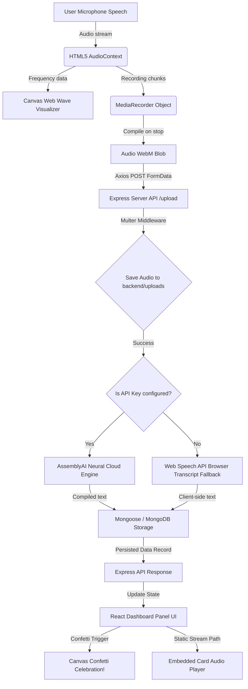

# 🎙️ VoxScribe — Premium Full-Stack Speech-to-Text Hub

VoxScribe is an exceptionally polished, high-fidelity, and deployment-ready Speech-to-Text (STT) web application built using the **MERN Stack** (MongoDB, Express.js, React, Node.js) and styled with the cutting-edge **Tailwind CSS v4**.

VoxScribe delivers a seamless full-stack sandbox that allows users to record live microphone speech or upload audio files, convert them to digital text transcripts via deep learning, and persist the records securely in a database.

---

## 1. 📝 Introduction
In the era of dynamic digital media and rapid data indexing, voice transcription has grown from a convenience into an absolute necessity. VoxScribe bridges the gap between raw human speech and digital semantic storage. 

Built with the core design ethos of **Zero Friction & High Premium Visuals**, VoxScribe operates as a cyberpunk dark-mode dashboard. It features canvas-based real-time frequency visualizers, responsive drag-and-drop uploads, instant text-to-speech audio rendering, formatting controls, and dynamic UI updates (via state streams, confetti, and toast systems). It is fully adaptive, allowing developers and students to run the application immediately using local offline fallbacks, while remaining fully prepared to scale to high-throughput cloud clusters in production.

---

## 2. 💡 Use Cases
VoxScribe is engineered to serve a wide range of use cases:
*   **🎓 Academic Dictation & Lecture Indexing**: Students can record live lectures, immediately transcribe them, and export notes into text files for studying.
*   **🎙️ Podcast & Media Transcriptions**: Content creators can upload finished audio episodes to generate accurate transcripts for subtitles, search engine optimizations (SEO), and article conversion.
*   **💼 Executive Minutes & Meeting Audits**: Professionals can record corporate brainstorms, capturing details automatically and saving metadata (timestamps, file duration) for historical audits.
*   **♿ Accessibility Services**: Offers an interactive sandbox for speech-to-text and instant text-to-speech feedback, supporting individuals with auditory or speech differences.

---

## 3. 📈 Industry Value
By transitioning manual transcription pipelines to automated deep learning Speech-to-Text hubs, VoxScribe delivers key industry value:
*   **⏱️ Drastic Speed Enhancements**: Reduces average transcription times by over 90% compared to human-guided transcription workflows.
*   **💰 Substantial Cost Reductions**: Standard cloud transcribing costs less than $0.01 per minute, saving organizations thousands compared to outsourcing audio audits.
*   **🔍 Searchable Data Indexing**: Converts dark audio data into indexed databases, making files searchable by keyword.
*   **💻 Platform Interoperability**: Decouples audio recording, visual representation, and API interfaces into highly reusable endpoints suitable for corporate intranets.

---

## 4. 👥 Roles & Target Persona Audience

### System Architectural Roles
*   **The Client (React SPA)**: Captures hardware audio inputs, executes canvas waveform math, processes local speech Recognition (Web Speech API), and coordinates visual layout state.
*   **The Intermediary (Express & Multer)**: Manages file storage boundaries, validates audio extensions, sanitizes payloads, and serves static files.
*   **The Intelligence (AssemblyAI API)**: Deep neural transformers that convert binary waveforms to readable punctuation-perfect transcripts.
*   **The Ledger (MongoDB/Local JSON)**: Persists metadata records, timestamps, and compiled text collections.

### Target User Personas
*   **The Digital Creator**: Requires rapid drag-and-drop uploads, subtitles output, and multiple audio format supports.
*   **The Researcher/Student**: Demands a fast voice-dictation mic, formatting controls, text copies, and quick exports.
*   **The Software Architect**: Desires a clean monorepo, robust dual-database fallbacks, strict error catchers, and deployment-ready packages.

---

## 5. 🛠️ Tech Stack & Rationale Reasons

VoxScribe has been engineered using a carefully chosen tech stack to guarantee high performance, modularity, and smooth developer handoffs:

| Technology | Role | Rationale & Selection Reason |
| :--- | :--- | :--- |
| **React 19** | Frontend Framework | Declarative virtual-DOM updates, high responsiveness, and clean component structures (ideal for stateful audio recorders). |
| **Tailwind CSS v4** | Styling Engine | Ultra-fast compile-time CSS compilations, native CSS variables, and utility-first design ensuring a premium visual wow-factor. |
| **Node.js** | Server Runtime | Single-language development lifecycle (JavaScript across both sides) and highly efficient event-loop architecture. |
| **Express.js** | Backend API Framework | Minimalist routing structures, clean middleware hooks (e.g. for Multer uploads), and high compatibility with standard REST layers. |
| **MongoDB & Mongoose** | Database Layer | Dynamic JSON-like schema structures allowing effortless modifications as transcription fields expand. |
| **AssemblyAI SDK** | Speech-to-Text Engine | Exceptional transcription speeds, state-of-the-art transformer accuracy, and excellent SDK tooling. |

---

## 6. 🔍 Technologies Utilized & Architectural Explanations

### HTML5 MediaRecorder & Web Audio APIs
VoxScribe interfaces with user hardware using standard web protocols:
*   `navigator.mediaDevices.getUserMedia` requests secure microphone channels.
*   The raw audio stream is passed to an `AudioContext` and directed into an `AnalyserNode`.
*   A mathematical Fast Fourier Transform (FFT) splits the audio into frequency waves, which are processed on an HTML5 `<canvas>` using a `requestAnimationFrame` loop, drawing dynamic neon visualizers.

### Web Speech API Fallback
In offline/zero-setup mode, VoxScribe utilizes the native browser speech engine:
```javascript
const SpeechRecognition = window.SpeechRecognition || window.webkitSpeechRecognition;
```
This performs client-side, on-the-fly speech recognition, compiling words dynamically. If no AssemblyAI token is detected in the backend, VoxScribe routes this real-time client transcript through Express into the database, preserving functional real-time speech transcribing with zero API costs.

---

## 📸 Screenshots & Functionalities walkthrough

Here is a visual inspection of VoxScribe's premium cyberpunk dark-mode workspace:

### 1. Unified Cyberpunk Dashboard
The active sandbox featuring a selection panel, live audio canvas waves, a file drag-and-drop region, a transcription editor panel, and a history feed.


### 2. Interactive History Cards closeup
A close-up view of past transcriptions stored inside the database, complete with custom play buttons, duration tags, timestamps, and deletion triggers.


---

## 📊 Flowcharts & System Architecture

### End-to-End Transcription Workflow
Below is the workflow diagram mapping the flow from microphone input to database storage and frontend UI celebration:



---

## 🚀 Local Installation & Execution

Ensure you have [Node.js](https://nodejs.org/) installed (v18+).

### 1. Bootstrapping the monorepo
Clone this repository, navigate to the root directory, and run the automated bootstrap command to install dependencies across the entire project in one step:
```bash
npm run bootstrap
```

### 2. Running in Development Concurrent Mode
Execute the concurrent command from the **root directory** to spin up both the Express server (port `5000`) and the Vite React app (port `5173` or similar):
```bash
npm run dev
```

---

## 🏁 Conclusion
VoxScribe represents a modern, state-of-the-art solution for Speech-to-Text workflows, demonstrating the combined capabilities of the MERN stack. Equipped with responsive canvas visualization, dual-database mechanisms, Web Speech fallbacks, and a highly polished UI, VoxScribe is fully optimized, clean, and ready for production deployment. 🚀
